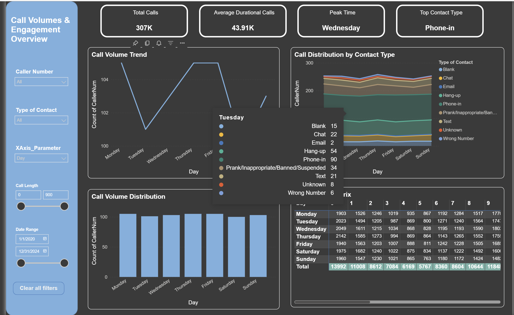
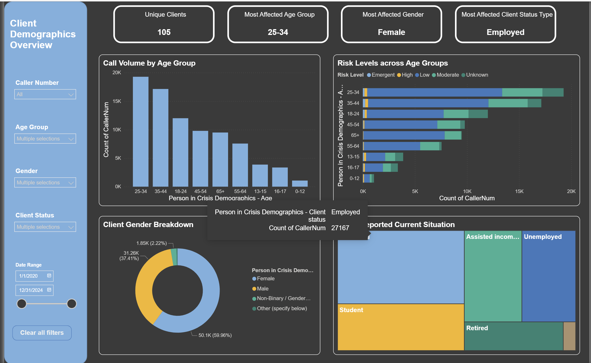
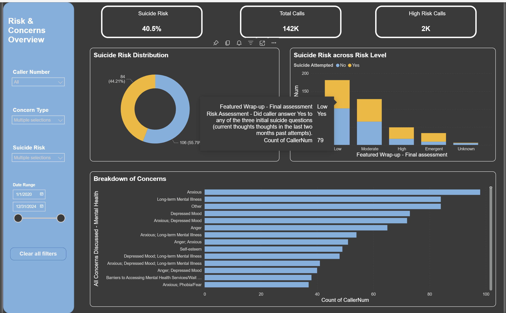

# 📊 Mental Health Support Dashboard | Power BI Project

This Power BI project presents a dashboard created to analyze and visualize key insights from crisis intervention data for **one of Canada's leading mental health support organizations**. The dashboard helps operational teams monitor trends in client engagement, assess demographic patterns, evaluate risk factors, and better allocate resources to support those in need.

---

## 🧠 Dashboard Highlights

### 🔹 1. Call Volume & Engagement Overview
- Yearly, Monthly, Weekly, daily and hourly call distribution across channels (Phone, Text, Chat).
- Heatmap matrix for identifying peak engagement times.
- Key indicators like average call duration and total call counts.

### 🔹 2. Demographic Breakdown
- Insights by gender, age groups, and employment status.
- Understand who is reaching out for help the most.

### 🔹 3. Risk & Primary Concerns
- Tracks suicide risk assessments and other critical risk levels.
- Visualizes primary emotional concerns (e.g., anxiety, depression, anger).
- Identifies barriers to accessing mental health support.

---

## 🧩 Key Features

- 📅 Time and category-based filtering using slicers.
- 📊 Clean and intuitive layout designed for rapid decision-making.
- 🧭 Built for teams working in crisis management and public health.

---

## ⚠️ Data & Access Notice

> 🔐 To maintain data privacy and confidentiality, the **raw dataset and Power BI (.pbix) file are not included** in this repository.  
> 📎 The visuals shared here are based on a sample dashboard exported as **screenshots** and a **PDF preview**.

---

## 📷 Dashboard Screenshots

### 🔸 Call Volume Overview

### 🔸 Demographics Breakdown

### 🔸 Risk & Concerns Overview

> 🔗 For a full dashboard walkthrough, you can download the PDF from the [`/docs`](./Docs/Dashboard_Preview.pdf) folder.

---

## 📌 About the Project

This dashboard project was created as part of an exploratory analysis initiative using Power BI. It demonstrates how visualization tools can empower public health teams with real-time insights into population needs and crisis response patterns.
